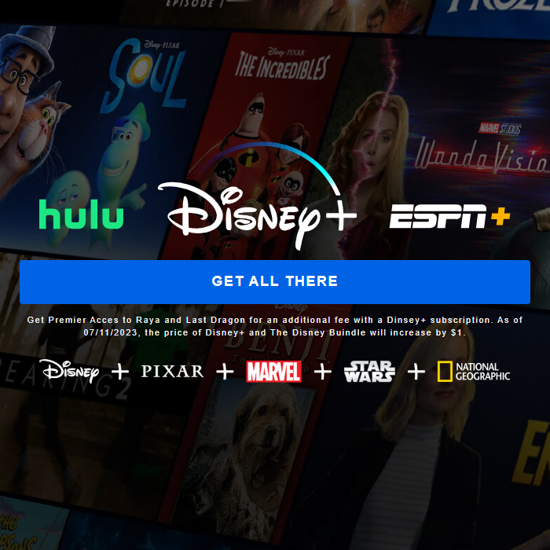

# Disney+ Clone


## Information

This project aims to create a clone of Disney+. It incorporates real-time database and user authentication using Firebase, manages state with Redux, and enhances visual aesthetics using Styled Components.

## Features

- Secure login through Firebase authentication.
- Ability to fetch pre-added movies from the Firebase database.
- User access management facilitated by Firebase.
- Display of recommended, newly added, trending, and original Disney movies.
- Page navigation enabled with React Router DOM.
- Visually impressive movie list presentation using Slick Carousel.
## How To Use
  
1. Clone the repository:
```bash
git clone https://github.com/remolg/Disney-Clone.git
```

2. Go to the project folder:
```bash
cd Disney-Clone
```

3. Install the required dependencies:
```bash
npm install
```

4. Start the application:
```bash
npm run dev
```

5. Visit the address below in your browser:
```bash
http://localhost:3000
```  

## Or You can go by clicking on the link

- [Disney+ Clone](https://remolg-disneyplus-clone.netlify.app/)